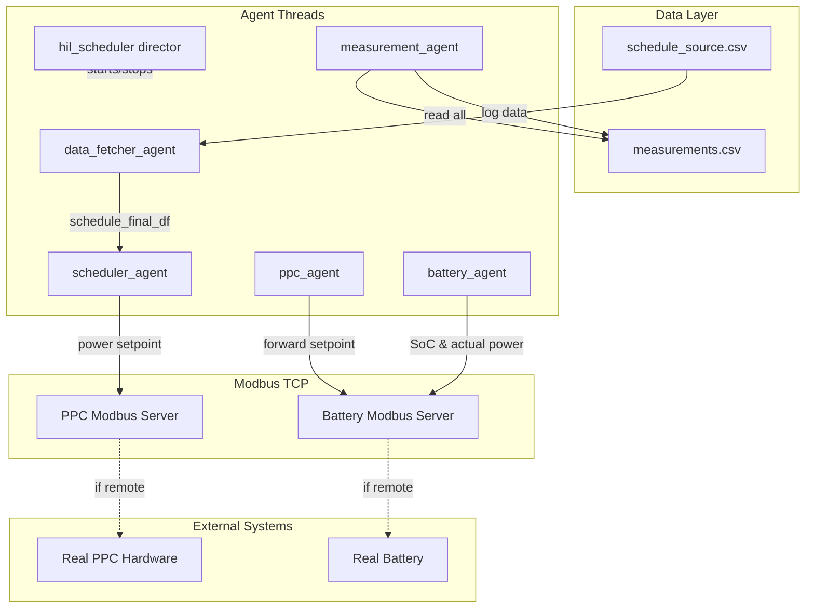

# Product Context: HIL Scheduler

## Why This Project Exists

This application serves as a **Hardware-in-the-Loop (HIL) scheduler** for testing and operating grid-connected battery energy storage systems. It bridges the gap between high-level power schedules and low-level battery control systems.

## Problems It Solves

### 1. Schedule Execution Gap
Power schedules often come in coarse time resolutions (e.g., 5-minute intervals from grid operators), but batteries need continuous setpoint updates. The scheduler:
- Interpolates coarse schedules to 1-minute resolution
- Further interpolates to 1-second execution granularity
- Ensures smooth power transitions

### 2. Safe Battery Operation
Batteries have strict operational boundaries:
- **SoC Limits**: Prevents over-charging (>capacity) and over-discharging (<0)
- **Power Limiting**: Automatically limits power when SoC boundaries would be exceeded
- **Warning System**: Logs warnings when power limiting occurs

### 3. Testing Without Hardware
The local emulation mode allows:
- Testing schedules without physical battery hardware
- Safe development and validation of control algorithms
- Simulation of different battery capacities and initial SoC states

### 4. Real-time Monitoring
The dashboard provides:
- Live visualization of scheduled vs actual power
- Battery State of Charge tracking
- Start/Stop controls for immediate intervention
- Status indicators for operational state

## How It Works

## User Experience Goals

### For Operators
1. **Simple Controls**: Start/Stop buttons for immediate control
2. **Clear Visualization**: Step-function graphs showing power setpoints
3. **Status Awareness**: Clear indication of running/stopped state
4. **Data Accessibility**: CSV files for post-run analysis

### For Developers
1. **Configurable Parameters**: All timing, power limits, and Modbus settings in config.py
2. **Clear Logging**: Structured logging for debugging multi-threaded issues
3. **Modular Agents**: Each agent is self-contained and can be tested independently
4. **Safe Defaults**: Conservative battery limits to prevent simulation errors

## Key Workflows

### Starting a Schedule Run
1. Director starts all agent threads
2. Data Fetcher generates random schedule and writes to CSV
3. Dashboard launches and waits for user to click Start
4. User clicks Start → Dashboard writes enable flag to PPC
5. Scheduler begins reading schedule and sending setpoints
6. Battery applies setpoints and tracks SoC
7. Measurement Agent logs all data

### Emergency Stop
1. User clicks Stop on dashboard
2. Dashboard writes disable flag to PPC
3. PPC sends 0kW setpoint to battery
4. Battery maintains current SoC
5. Measurement continues logging (showing 0kW applied)
