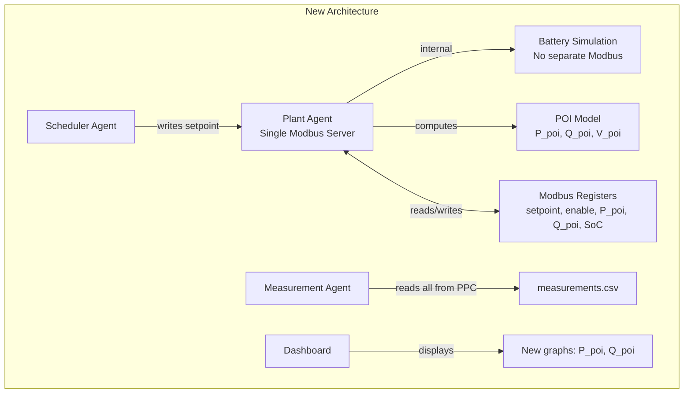

# Plan: Merge PPC/Battery Agents and Add Plant Model

## Overview
Merge the functionality of `ppc_agent.py` and `battery_agent.py` into a single `plant_agent.py`, move configuration to YAML, and add a plant model with impedance between the battery and the Point of Interconnection (POI).

## New Architecture



## Changes Summary

### 1. Configuration (YAML)

Create `config.yaml` to replace `config.py`:

```yaml
# General Settings
general:
  log_level: INFO
  schedule_source_csv: "schedule_source.csv"
  schedule_start_time: "2026-01-30T16:00:00"  # Will be replaced with current time on load
  schedule_duration_h: 0.5
  schedule_power_min_kw: -1000
  schedule_power_max_kw: 1000

# Timing
timing:
  data_fetcher_period_s: 1
  scheduler_period_s: 1
  plant_period_s: 5
  measurement_period_s: 2
  measurements_write_period_s: 2

# Plant Configuration
plant:
  capacity_kwh: 50.0
  initial_soc_pu: 0.5
  
  # Plant Model Parameters
  impedance:
    r_ohm: 0.01      # Resistance between battery and POI
    x_ohm: 0.1       # Reactance between battery and POI
  
  nominal_voltage_v: 400.0   # Nominal system voltage (line-to-line)
  base_power_kva: 1000.0     # Base power for per-unit calculations
  power_factor: 1.0          # Battery power factor (1.0 = unity)

# Modbus Configuration
modbus:
  host: "localhost"
  port: 5020
  
  # Register Map
  registers:
    setpoint_in: 0        # 32-bit: Power setpoint from scheduler (hW)
    setpoint_actual: 2    # 32-bit: Actual power after limiting (hW)
    enable: 10            # 16-bit: Enable flag (0=disabled, 1=enabled)
    soc: 12               # 16-bit: State of Charge (x10000)
    p_poi: 14             # 32-bit: Active power at POI (hW)
    q_poi: 16             # 32-bit: Reactive power at POI (hW)
    v_poi: 18             # 16-bit: Voltage at POI (x100 for 2 decimal places)

# Output Files
output:
  measurements_csv: "measurements.csv"
```

### 2. Plant Agent (`plant_agent.py`)

The plant agent merges functionality from both agents:

#### Key Components:

1. **Modbus Server**: Single server (PPC interface only)
   - Register 0-1: Setpoint input (from scheduler)
   - Register 10: Enable flag
   - Register 2-3: Actual setpoint (after limiting)
   - Register 12: SoC (per-unit x10000)
   - Register 14-15: P_poi (active power at POI)
   - Register 16-17: Q_poi (reactive power at POI)
   - Register 18: V_poi (voltage at POI)

2. **Battery Simulation** (internal, no Modbus):
   - Same SoC tracking logic from `battery_agent.py`
   - Power limiting based on SoC boundaries
   - Calculates battery terminal power (P_batt, Q_batt)

3. **Plant Model** (new):
   - Simple impedance model: Z = R + jX
   - Current calculation: I = S_batt* / V_batt (conjugate for apparent power)
   - Voltage drop: V_drop = I * Z
   - POI voltage: V_poi = V_batt - V_drop
   - POI power: S_poi = V_poi * I*

#### Simplified Plant Model Algorithm:

```python
# Given: P_batt_kw (actual power from battery simulation)
# Given: power_factor (from config)

# 1. Calculate battery apparent power
S_batt_kva = abs(P_batt_kw) / power_factor
Q_batt_kvar = sqrt(S_batt_kva^2 - P_batt_kw^2) * sign(P_batt_kw)

# 2. Calculate current (assuming nominal voltage at battery)
V_nom_kv = nominal_voltage_v / 1000 / sqrt(3)  # Phase voltage in kV
I_ka = S_batt_kva / (3 * V_nom_kv)  # Per-phase current in kA
I_complex = I_ka * (cos(phi) - j*sin(phi))  # Current phasor

# 3. Calculate voltage drop across impedance
V_drop_kv = I_complex * (R_ohm + j*X_ohm) * (nominal_voltage_v / 1000) / base_voltage

# 4. Calculate POI voltage
V_poi_kv = V_nom_kv - V_drop_kv
V_poi_pu = abs(V_poi_kv) / V_nom_kv

# 5. Calculate power at POI
S_poi_kva = 3 * V_poi_kv * conj(I_complex)
P_poi_kw = real(S_poi_kva)
Q_poi_kvar = imag(S_poi_kva)
```

### 3. Measurement Agent Updates

- Remove battery client (only PPC client needed)
- Read additional registers: P_poi, Q_poi, V_poi
- Add new columns to measurements DataFrame:
  - `p_poi_kw`
  - `q_poi_kvar`
  - `v_poi_pu` (optional)

### 4. Dashboard Agent Updates

- Add new subplot or traces for POI measurements
- Display P_poi and Q_poi alongside battery power
- Show V_poi if desired

### 5. Hil Scheduler Updates

- Replace imports of `ppc_agent` and `battery_agent` with `plant_agent`
- Start only one plant agent thread instead of two
- Load configuration from YAML instead of config.py

### 6. Requirements Update

Add to `requirements.txt`:
```
PyYAML>=6.0
```

## File Changes

### New Files:
- `config.yaml` - YAML configuration
- `plant_agent.py` - Merged agent with plant model

### Modified Files:
- `hil_scheduler.py` - Use plant_agent, load YAML config
- `measurement_agent.py` - Read from PPC only, add POI values
- `dashboard_agent.py` - Display P_poi, Q_poi
- `requirements.txt` - Add PyYAML

### Deleted Files:
- `ppc_agent.py` - Functionality merged into plant_agent
- `battery_agent.py` - Functionality merged into plant_agent
- `config.py` - Replaced by config.yaml

## New Register Map (Local Mode)

| Address | Size | Name | Description |
|---------|------|------|-------------|
| 0-1 | 2 words | SETPOINT_IN | Power setpoint from scheduler (hW, signed 32-bit) |
| 2-3 | 2 words | SETPOINT_ACTUAL | Actual power after SoC limiting (hW, signed 32-bit) |
| 10 | 1 word | ENABLE | Enable flag (0=disabled, 1=enabled) |
| 12 | 1 word | SOC | State of Charge (per-unit x10000) |
| 14-15 | 2 words | P_POI | Active power at POI (hW, signed 32-bit) |
| 16-17 | 2 words | Q_POI | Reactive power at POI (hW, signed 32-bit) |
| 18 | 1 word | V_POI | Voltage at POI (per-unit x100, unsigned) |

## Measurements CSV Schema

Updated columns:
- `timestamp`
- `original_setpoint_kw` - Setpoint from scheduler
- `actual_setpoint_kw` - Actual power after SoC limiting (battery terminal)
- `soc_pu` - State of charge (0-1)
- `p_poi_kw` - Active power at POI (NEW)
- `q_poi_kvar` - Reactive power at POI (NEW)
- `v_poi_pu` - Voltage at POI (NEW, optional)
