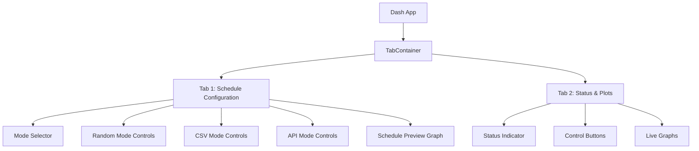

# Dashboard UI Improvement Plan

## Overview
Improve the HIL Scheduler dashboard with a modern, professional light theme featuring a clean, compact layout with two tabs for better organization.

## Current Issues
- Cluttered interface with all controls visible at once
- Inconsistent styling and spacing
- Large graphs with no tab organization
- Basic border styling without professional polish
- No responsive design considerations

## Design Goals
1. **Light Theme**: Clean white background with soft grays for structure
2. **Two Tabs**: Schedule Configuration | Status & Plots
3. **Compact Layout**: Efficient use of screen space
4. **Responsive**: Adapts to different screen sizes
5. **Uniform Styling**: Consistent colors, spacing, and component styles

---

## Implementation Plan

### Phase 1: Foundation & Styling

#### 1.1 Add Global CSS Styles
Create a cohesive design system with:
- Color palette (light theme)
  - Primary: `#2563eb` (professional blue)
  - Success: `#16a34a` (green)
  - Warning: `#ea580c` (orange)
  - Error: `#dc2626` (red)
  - Background: `#f8fafc` (very light gray)
  - Surface: `#ffffff` (white)
  - Border: `#e2e8f0` (light gray)
  - Text: `#1e293b` (dark slate)
- Typography: System fonts with consistent sizing
- Spacing scale: 4px, 8px, 12px, 16px, 24px
- Border radius: 6px for modern look
- Shadows: Subtle shadows for depth

#### 1.2 Create Tab Structure
Replace single-page layout with:

---

### Phase 2: Schedule Configuration Tab

#### 2.1 Mode Selector (Radio Cards)
Replace inline radio buttons with styled cards:
- Hover effects
- Selected state highlighting
- Icon-based visual feedback

#### 2.2 Mode Controls (Collapsible Cards)
Each mode gets a collapsible card:
- **Random Mode**: Input fields for duration, min/max power, Generate button
- **CSV Mode**: File upload dropzone, datetime picker, Load button
- **API Mode**: Password input, Connect button, status display

#### 2.3 Schedule Preview
Compact graph showing upcoming schedule:
- Height: ~200px
- Shows next 24 hours of schedule
- Interactive tooltips

#### 2.4 Common Actions
- Clear Schedule button (prominent but not primary)
- Current mode status indicator

---

### Phase 3: Status & Plots Tab

#### 3.1 Status Header
Compact status bar with:
- Running/Stopped indicator with color coding
- Current mode display
- Last update timestamp

#### 3.2 Control Buttons
Row of control buttons:
- Start/Stop buttons with icon + text
- Clean button styling with hover states

#### 3.3 Main Graphs
Three subplots in a compact layout:
- **Active Power (kW)**: Setpoint vs Actual vs POI
- **State of Charge (pu)**: Single trace
- **Reactive Power (kvar)**: Setpoint vs Actual vs POI

Graph improvements:
- Height: ~500px total
- Uniform legend positioning
- Clean axis labels
- Consistent color scheme with main graph

---

### Phase 4: Responsive & Polish

#### 4.1 Responsive Layout
- Use CSS Grid/Flexbox for flexible layouts
- Stack inputs on mobile (<768px)
- Reduce graph heights on smaller screens
- Touch-friendly button sizes (min 44px)

#### 4.2 Component Unification
All components use same styling:
- Input fields: consistent padding, border, focus states
- Buttons: consistent colors, hover effects, transitions
- Graph cards: uniform shadows, headers, spacing
- Status indicators: consistent color coding

#### 4.3 Visual Refinements
- Smooth transitions on tab changes
- Loading states for async operations
- Error/success messages with toast notifications
- Empty states for when data isn't available

---

## File Changes

### dashboard_agent.py
- Add CSS stylesheet (inline or external)
- Restructure layout with Tabs component
- Update all component styling
- Refactor callbacks for tab-aware updates
- Add responsive CSS media queries

---

## Visual Style Reference

### Color Scheme
| Element | Color | Usage |
|---------|-------|-------|
| Background | `#f8fafc` | Main app background |
| Card Background | `#ffffff` | Content cards |
| Primary | `#2563eb` | Primary buttons, active tabs |
| Success | `#16a34a` | Running status, success messages |
| Error | `#dc2626` | Stopped status, errors |
| Warning | `#ea580c` | Warnings, pending states |
| Border | `#e2e8f0` | Card borders, dividers |
| Text Primary | `#1e293b` | Headings, important text |
| Text Secondary | `#64748b` | Labels, descriptions |

### Spacing Scale
- xs: 4px (compact elements)
- sm: 8px (between related items)
- md: 12px (standard padding)
- lg: 16px (card padding)
- xl: 24px (section spacing)

### Component Styling
- **Cards**: White bg, 1px border, 8px radius, subtle shadow
- **Buttons**: 8px radius, 44px min-height, transition effects
- **Inputs**: 6px radius, 36px height, focus ring
- **Tabs**: Underline indicator for active tab
- **Graphs**: Clean white background, minimal grid lines

---

## Success Criteria
- [ ] Two clear tabs: Schedule Configuration, Status & Plots
- [ ] Light, professional color scheme
- [ ] Uniform styling across all components
- [ ] Responsive layout (desktop + mobile)
- [ ] Compact display with efficient use of space
- [ ] Clean, easy-to-read interface
