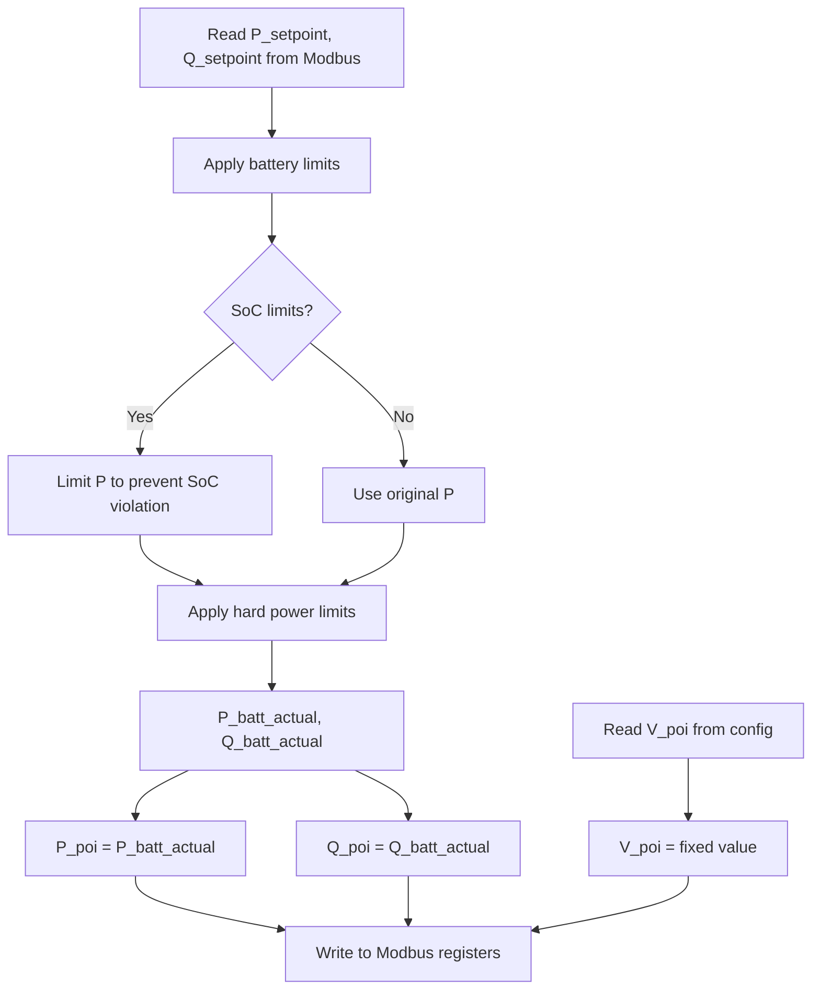

# Plan: Simplify Plant Agent Calculations

## Overview
Simplify the plant agent by eliminating the impedance model from the electrical calculations. With no impedance between battery and POI, plant power equals battery power.

## Current State Analysis

### Existing Implementation (plant_agent.py)
The current implementation includes:
1. **Complex impedance model** (`calculate_poi_power` function, lines 89-144)
   - Calculates apparent and reactive power at battery
   - Converts to phase values
   - Calculates current with phase angles
   - Computes voltage drop across impedance (R + jX)
   - Calculates POI voltage and power accounting for losses

2. **Configuration parameters** (config.yaml)
   - `impedance.r_ohm`: 0.01Ω
   - `impedance.x_ohm`: 0.1Ω
   - `nominal_voltage_v`: 400V
   - `base_power_kva`: 1000kVA
   - `power_factor`: 1.0

3. **Calculation flow**
   ```
   P_setpoint, Q_setpoint → Battery limits (SoC + hard limits) → P_batt_actual, Q_batt_actual
   → Impedance model → P_poi, Q_poi, V_poi
   ```

### Problem
The impedance calculations are overly complex and will be eliminated. The plant model should be simplified to:
- Plant power = Battery power (no losses)
- POI voltage = Fixed configuration value

## Proposed Changes

### 1. Configuration Changes (config.yaml)

**Remove:**
```yaml
impedance:
  r_ohm: 0.01
  x_ohm: 0.1
nominal_voltage_v: 400.0
base_power_kva: 1000.0
power_factor: 1.0
```

**Add:**
```yaml
poi_voltage_v: 20000.0  # Fixed POI voltage in Volts (20 kV)
```

### 2. Code Changes (plant_agent.py)

**Remove:**
- `calculate_poi_power()` function (lines 89-144)
- Impedance-related imports: `cmath` (line 4)
- Impedance parameters: `r_ohm`, `x_ohm`, `v_nom_v`, `base_power_kva`, `power_factor` (lines 38-42)

**Simplify:**
- POI voltage: Read from config and write to register (no calculation)
- POI power: Equal to battery power (no impedance losses)

**New simplified flow:**


### 3. Code Structure Changes

**Before (lines 89-144):**
```python
def calculate_poi_power(p_batt_kw, v_nom_v, r_ohm, x_ohm, power_factor):
    # 55 lines of complex impedance calculations
    return p_poi_kw, q_poi_kvar, v_poi_pu
```

**After:**
```python
# No function needed - direct assignment
p_poi_kw = actual_p_kw  # Plant power = battery power
q_poi_kvar = actual_q_kvar  # Plant reactive = battery reactive
v_poi_v = config["PLANT_POI_VOLTAGE_V"]  # Fixed from config (20 kV)
```

### 4. Configuration Loader Changes (config_loader.py)

**Add mapping:**
```python
config["PLANT_POI_VOLTAGE_V"] = yaml_config["plant"]["poi_voltage_v"]
```

**Remove mappings:**
```python
config["PLANT_R_OHM"] = yaml_config["plant"]["impedance"]["r_ohm"]
config["PLANT_X_OHM"] = yaml_config["plant"]["impedance"]["x_ohm"]
config["PLANT_NOMINAL_VOLTAGE_V"] = yaml_config["plant"]["nominal_voltage_v"]
config["PLANT_BASE_POWER_KVA"] = yaml_config["plant"]["base_power_kva"]
config["PLANT_POWER_FACTOR"] = yaml_config["plant"]["power_factor"]
```

## Detailed Implementation Steps

### Step 1: Update config.yaml
- Remove impedance section
- Remove nominal_voltage_v, base_power_kva, power_factor
- Add poi_voltage_pu: 1.0

### Step 2: Update config_loader.py
- Remove impedance-related config mappings
- Add PLANT_POI_VOLTAGE_PU mapping

### Step 3: Simplify plant_agent.py
- Remove `cmath` import
- Remove impedance parameter initialization
- Remove `calculate_poi_power()` function
- Replace POI calculation with direct assignment
- Update V_poi to use fixed config value (20 kV in Volts)
- Note: V_poi register is still per-unit x100, so need to convert from Volts to per-unit

### Step 4: Update memory bank documentation
- Update systemPatterns.md to remove impedance model section
- Update activeContext.md to reflect simplified model
- Document that plant power = battery power

## Expected Benefits

1. **Simplified code**: Remove ~60 lines of complex calculations
2. **Clearer logic**: Direct assignment instead of impedance model
3. **Easier maintenance**: Fewer parameters and calculations to understand
4. **Better performance**: No complex math operations per iteration

## Files to Modify

1. `config.yaml` - Update plant configuration
2. `config_loader.py` - Update config mappings
3. `plant_agent.py` - Simplify calculations
4. `memory-bank/systemPatterns.md` - Update documentation
5. `memory-bank/activeContext.md` - Update context

## Testing Considerations

After implementation, verify:
1. P_poi equals P_battery_actual
2. Q_poi equals Q_battery_actual
3. V_poi equals fixed config value (20 kV in Volts, converted to per-unit for Modbus register)
4. SoC limiting still works correctly
5. Hard power limits still work correctly
6. Modbus registers are updated correctly
