# Schedule Switch Confirmation Implementation Plan

## Overview
Implement confirmation modal for schedule type switching (Manual/API) and ensure both plant and schedule switches properly flush measurements to CSV and clear the measurements DataFrame.

## Current State

### Plant Switching (existing)
- Has confirmation modal at lines 358-375
- On confirm: stops plant via Modbus, updates `selected_plant` in shared_data
- Does NOT currently flush measurements

### Schedule Switching (existing)
- No confirmation modal
- Immediate switch in `select_active_source` callback (lines 733-758)
- Updates `active_schedule_source` in shared_data directly

### Measurement Handling (existing)
- `measurement_agent.py` has `write_measurements_to_csv()` function (lines 84-100)
- `handle_filename_change()` flushes on filename change (lines 102-119)
- Measurements stored in `shared_data['measurements_df']`
- Filename stored in `shared_data['measurements_filename']`

## Implementation Plan

### Phase 1: Add Schedule Switch Confirmation Modal

#### 1.1 Add Modal UI in dashboard_agent.py
**Location:** After plant-switch-modal (around line 375)

Add new modal div with id='schedule-switch-modal':
- Position: fixed overlay like plant modal
- Title: "Confirm Schedule Switch"
- Message: "Switching schedule source will stop the system and flush current measurements. Continue?"
- Buttons: Cancel, Confirm
- Initially hidden with className='hidden'

#### 1.2 Modify select_active_source Callback
**Location:** Lines 733-758

Current behavior:
- Immediately updates shared_data['active_schedule_source']
- Returns new toggle button states

New behavior:
- Check if actual switch is requested (different from current)
- If switching: return current state + show modal (className='')
- If not switching: return current state + keep modal hidden
- Store pending source value (can use dash Store or infer from trigger)

#### 1.3 Add Schedule Switch Confirmation Callback
**Location:** After plant selection callback (after line 864)

New callback with inputs:
- source-manual-btn.n_clicks
- source-api-btn.n_clicks  
- schedule-switch-cancel.n_clicks
- schedule-switch-confirm.n_clicks

States:
- active-source-selector.value (current/pending value)

Outputs:
- active-source-selector.value
- source-manual-btn.className
- source-api-btn.className
- schedule-switch-modal.className

Logic:
- If cancel clicked: hide modal, return current values
- If confirm clicked:
  1. Run `perform_schedule_switch()` in background thread
  2. Hide modal
  3. Return new toggle states

#### 1.4 Implement perform_schedule_switch Function
**Location:** Inside select_schedule callback or as helper

Function steps:
1. Stop the system (send 0 to enable register)
2. Flush measurements to current file
3. Clear measurements DataFrame
4. Update `active_schedule_source` in shared_data

### Phase 2: Update Plant Switch to Flush Measurements

#### 2.1 Modify perform_plant_switch Function
**Location:** Lines 802-843

Add to existing function:
1. Flush measurements to current file (same as schedule switch)
2. Clear measurements DataFrame
3. Then proceed with existing plant stop and switch logic

### Phase 3: Create Shared Helper Functions

#### 3.1 Create flush_and_clear_measurements Helper
**Location:** dashboard_agent.py as nested function or module-level

Function:
- Read `measurements_filename` from shared_data
- If filename exists: write DataFrame to CSV
- Clear `measurements_df` in shared_data
- Clear `measurements_filename` in shared_data (or keep for new file?)

#### 3.2 Create stop_system Helper
**Location:** dashboard_agent.py

Function:
- Read selected_plant from shared_data
- Connect to correct plant via Modbus
- Write 0 to enable register
- Close connection

### Phase 4: Add Shared Data Flag

#### 4.1 Add schedule_switching Flag
**Location:** hil_scheduler.py line ~73

Add alongside existing flags:
```python
"plant_switching": False,
"schedule_switching": False,  # NEW
```

## Mermaid Flow Diagram

```mermaid
flowchart TD
    subgraph Schedule_Switch_Flow
        A[User clicks Manual/API] --> B{Is different from current?}
        B -->|No| C[No action needed]
        B -->|Yes| D[Show confirmation modal]
        D --> E[User clicks Cancel]
        D --> F[User clicks Confirm]
        E --> G[Hide modal, no changes]
        F --> H[Stop system]
        H --> I[Flush measurements to CSV]
        I --> J[Clear measurements DataFrame]
        J --> K[Update active_schedule_source]
        K --> L[Hide modal, update UI]
    end
    
    subgraph Plant_Switch_Flow_Updated
        M[User clicks Local/Remote] --> N{Is different from current?}
        N -->|No| O[No action needed]
        N -->|Yes| P[Show confirmation modal]
        P --> Q[User clicks Cancel]
        P --> R[User clicks Confirm]
        Q --> S[Hide modal, no changes]
        R --> T[Stop system]
        T --> U[Flush measurements to CSV]
        U --> V[Clear measurements DataFrame]
        V --> W[Stop plant via Modbus]
        W --> X[Update selected_plant]
        X --> Y[Hide modal, update UI]
    end
```



## Files to Modify

1. **dashboard_agent.py**
   - Add schedule switch modal HTML (lines ~376)
   - Modify `select_active_source` callback (lines 733-758)
   - Add schedule switch confirmation callback (new)
   - Update `perform_plant_switch` to flush measurements
   - Add helper functions for stop/flush/clear

2. **hil_scheduler.py**
   - Add `schedule_switching` flag to shared_data (line ~73)

## Code Structure

### Helper Functions (to add in dashboard_agent.py)

```python
def stop_system(config, shared_data):
    """Stop the system by writing 0 to enable register."""
    # Get selected plant
    # Connect via Modbus
    # Write 0 to enable register
    # Close connection
    pass

def flush_and_clear_measurements(shared_data):
    """Flush measurements to CSV and clear DataFrame."""
    # Get measurements_filename and measurements_df
    # Write to CSV if filename exists and df not empty
    # Clear measurements_df
    # Clear measurements_filename
    pass
```

### Updated perform_plant_switch

```python
def perform_plant_switch():
    try:
        # 1. Stop system and flush measurements
        stop_system(config, shared_data)
        flush_and_clear_measurements(shared_data)
        
        # 2. Stop current plant (existing logic)
        # ... existing code ...
        
        # 3. Update selected_plant
        with shared_data['lock']:
            shared_data['selected_plant'] = requested_plant
            shared_data['plant_switching'] = False
            
    except Exception as e:
        logging.error(f"Error during plant switch: {e}")
        with shared_data['lock']:
            shared_data['plant_switching'] = False
```

### New perform_schedule_switch

```python
def perform_schedule_switch(requested_source):
    try:
        # 1. Stop system and flush measurements
        stop_system(config, shared_data)
        flush_and_clear_measurements(shared_data)
        
        # 2. Update active_schedule_source
        with shared_data['lock']:
            shared_data['active_schedule_source'] = requested_source
            shared_data['schedule_switching'] = False
            
        logging.info(f"Dashboard: Switched to {requested_source} schedule")
            
    except Exception as e:
        logging.error(f"Error during schedule switch: {e}")
        with shared_data['lock']:
            shared_data['schedule_switching'] = False
```

## Testing Checklist

- [ ] Schedule switch modal appears when clicking different source
- [ ] Cancel button closes modal without changes
- [ ] Confirm button stops system
- [ ] Confirm button flushes measurements to CSV
- [ ] Confirm button clears measurements DataFrame
- [ ] Plant switch also flushes and clears measurements
- [ ] Measurements filename cleared after flush
- [ ] UI updates correctly after switch completes
- [ ] System can be restarted after switch
- [ ] New measurements recorded to new file after switch
