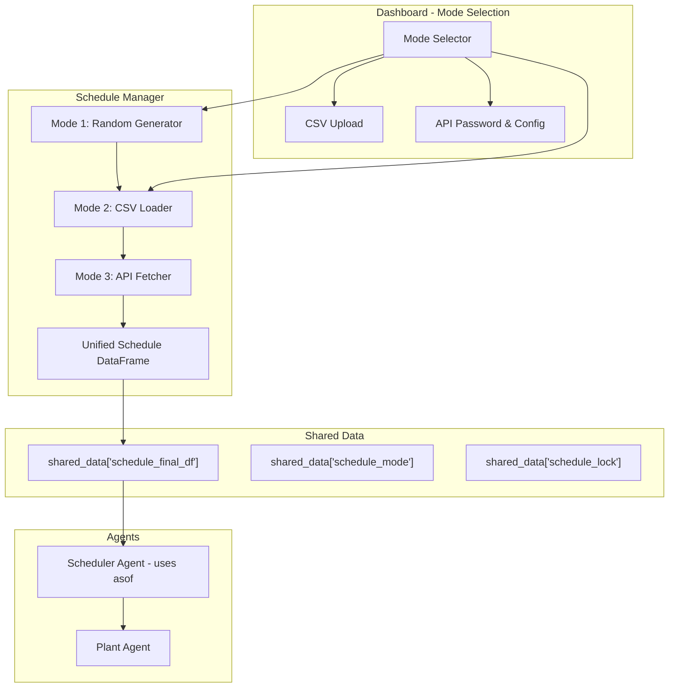

# Implementation Plan: Extended Setpoint Modes

## Overview

This plan describes how to extend the HIL Scheduler to support three different modes for obtaining setpoints:
1. **Mode 1**: Random schedule generation (no upsampling)
2. **Mode 2**: Upload CSV via dashboard with selectable start time
3. **Mode 3**: Fetch from Istentore API with automatic polling for next-day schedules

## Architecture Changes



## Files to Create/Modify

### 1. Create: `istentore_api.py`

Wrapper class around the Istentore API with session-based password handling.

**Key Functions:**
- `login(password)` - Authenticate with API
- `get_day_ahead_schedule(start_time, end_time)` - Fetch day-ahead schedule
- `is_authenticated()` - Check if current session has valid token
- Handle token refresh on expiration

### 2. Create: `schedule_manager.py`

Central module for managing schedules across all modes.

**Key Classes/Functions:**
- `ScheduleMode` enum: RANDOM, CSV, API
- `ScheduleManager` class:
  - `set_mode(mode, **kwargs)` - Switch between modes
  - `generate_random_schedule(start_time, duration_h, min_power, max_power, resolution_min=5)` - Mode 1 (5-min default, configurable)
  - `load_csv_schedule(csv_path, start_time)` - Mode 2 (preserves original CSV time resolution)
  - `fetch_current_day_schedule()` - Mode 3: Fetch current day schedule immediately when switching to API mode
  - `fetch_next_day_schedule()` - Mode 3: Fetch next day schedule (used in polling)
  - `append_schedule(new_data, replace_overlapping=True)` - Add new data, replace only overlapping periods
  - `get_schedule()` - Return current schedule DataFrame
  - `clear_schedule()` - Clear all schedule data
  - `start_api_polling(poll_interval_min=10, start_poll_time="17:30")` - Mode 3 polling

**DataFrame Structure:**
```python
# Index: datetime (flexible resolution - matches source data)
# Columns:
#   - power_setpoint_kw: float
#   - reactive_power_setpoint_kvar: float (defaults to 0)
```

### 3. Modify: `data_fetcher_agent.py`

Simplify to use schedule_manager.

**Changes:**
- Remove random schedule generation (moved to schedule_manager)
- Remove CSV reading and upsampling (moved to schedule_manager)
- Add callbacks to schedule_manager for mode changes triggered from dashboard
- Keep periodic refresh loop (for API polling)

### 4. Modify: `scheduler_agent.py`

Update for free-duration schedules.

**Changes:**
- Remove hardcoded duration check
- Use `asof()` to find value just before current time (already done)
- Handle empty schedule gracefully (already done)
- No changes needed - already works with free-duration

### 5. Modify: `config.yaml`

Add API and polling configuration.

```yaml
# API Configuration
istentore_api:
  base_url: "https://3mku48kfxf.execute-api.eu-south-2.amazonaws.com/default"
  email: "i-STENTORE"
  poll_interval_min: 10
  poll_start_time: "17:30"  # Start polling for next day at this time
  schedule_lookahead_hours: 48  # How far ahead to fetch schedules

# Default Schedule Settings
schedule:
  default_min_power_kw: -1000
  default_max_power_kw: 1000
  default_q_power_kvar: 0  # Default Q when not provided
```

### 6. Modify: `config_loader.py`

Add loading of new configuration sections.

### 7. Modify: `dashboard_agent.py`

Add mode selection UI and controls.

**New UI Elements:**
- **Mode Selector**: Radio button group (Random, CSV, API)
- **Random Mode Controls**:
  - Duration input (hours)
  - Min/Max power inputs
  - "Generate" button
- **CSV Mode Controls**:
  - File upload component
  - Start time datetime picker
  - "Load" button
- **API Mode Controls**:
  - Password input (session-persistent)
  - "Connect & Fetch" button
  - Polling status indicator
- **Common Controls**:
  - "Clear Schedule" button
  - Current mode indicator
  - Schedule preview graph

**Callback Changes:**
- Add callback to handle mode changes
- Add callbacks for each mode's controls
- Store mode and password in `shared_data` for agent access

### 8. Modify: `hil_scheduler.py`

Update to use new architecture.

**Changes:**
- Remove data_fetcher_agent from default threads (optional - keep for API polling)
- Pass schedule_manager to dashboard and agents
- Initialize shared_data with schedule_manager reference

## Implementation Steps

### Step 1: Create isitentore_api.py
- Wrap consultasAPI_V9.py logic
- Add session-based password handling
- Add error handling for expired tokens

### Step 2: Extend config.yaml
- Add istentore_api section
- Add schedule defaults section

### Step 3: Extend config_loader.py
- Load new config sections
- Add to flat dictionary

### Step 4: Create schedule_manager.py
- Implement ScheduleMode enum
- Implement ScheduleManager class
- Handle all 3 modes
- Handle API polling logic

### Step 5: Modify data_fetcher_agent.py
- Use schedule_manager for random generation
- Remove upsampling (Mode 1 uses original resolution)
- Keep periodic refresh for API polling

### Step 6: Modify scheduler_agent.py
- Verify asof() usage for finding value before current time
- No significant changes needed

### Step 7: Extend dashboard_agent.py
- Add mode selection UI
- Add controls for each mode
- Store mode/password in shared_data

### Step 8: Modify hil_scheduler.py
- Initialize schedule_manager
- Pass to agents
- Update agent thread creation

### Step 9: Testing
- Test Mode 1: Random schedule generation
- Test Mode 2: CSV upload with different start times
- Test Mode 3: API fetch and polling
- Test mode switching
- Verify asof() behavior

## API Polling Logic (Mode 3)

When switching to API mode:
1. Immediately fetch current day schedule
2. Start polling for next day schedule at 17:30

```python
def start_api_polling(self, poll_interval_min=10, start_poll_time="17:30"):
    """Start background thread for polling next-day schedules."""
    # On first call to API mode, fetch current day schedule immediately
    def fetch_current_day():
        now = datetime.now()
        today_start = now.replace(hour=0, minute=0, second=0, microsecond=0)
        today_end = today_start + timedelta(days=1) - timedelta(minutes=15)
        
        schedule = api.get_day_ahead_schedule(today_start, today_end)
        if schedule:
            self.append_schedule(schedule)
            logging.info("Current day schedule fetched successfully")
    
    # Fetch current day immediately
    fetch_current_day()
    
    # Polling for next day schedule
    while not shutdown_event.is_set():
        now = datetime.now()
        current_time = now.strftime("%H:%M")
        
        # Check if it's time to start polling (e.g., 17:30)
        if current_time >= start_poll_time:
            # Try to fetch next day schedule
            next_day_start = (now + timedelta(days=1)).replace(hour=0, minute=0, second=0)
            next_day_end = next_day_start + timedelta(days=1) - timedelta(minutes=15)
            
            try:
                schedule = api.get_day_ahead_schedule(next_day_start, next_day_end)
                if schedule:
                    self.append_schedule(schedule)
                    logging.info("Next day schedule fetched successfully")
                    break  # Exit polling loop after successful fetch
            except Exception as e:
                logging.error(f"Failed to fetch next day schedule: {e}")
        
        # Wait for poll interval
        time.sleep(poll_interval_min * 60)
```

## Schedule DataFrame Format

The schedule DataFrame uses flexible resolution (matches source data):

```python
# Index: datetime (5-min from API, or original CSV resolution)
# Columns:
#   - power_setpoint_kw: float
#   - reactive_power_setpoint_kvar: float (defaults to 0)

# Example (5-min resolution from API):
#                          power_setpoint_kw  reactive_power_setpoint_kvar
# 2026-01-31 00:00:00                 100.0                           0.0
# 2026-01-31 00:05:00                 150.0                           0.0
# 2026-01-31 00:10:00                 200.0                           0.0

# Example (15-min resolution from CSV):
#                          power_setpoint_kw  reactive_power_setpoint_kvar
# 2026-01-31 00:00:00                 100.0                           0.0
# 2026-01-31 00:15:00                 150.0                           0.0
# 2026-01-31 00:30:00                 200.0                           0.0
```

The scheduler will use `asof()` to find the value just before the current time:
```python
current_row = schedule_final_df.asof(datetime.now())
```

## Data Replacement Logic

When new data is added (via `append_schedule`):
- New data replaces ONLY existing data for overlapping time periods
- Non-overlapping data is preserved
- This allows accumulating schedules from multiple sources (e.g., current day + next day)

```python
def append_schedule(self, new_data, replace_overlapping=True):
    """Add new schedule data, replacing overlapping periods only."""
    if self._schedule_df.empty:
        self._schedule_df = new_data.copy()
        return
    
    if replace_overlapping:
        # Remove overlapping rows from existing schedule
        existing_times = self._schedule_df.index.difference(new_data.index)
        self._schedule_df = self._schedule_df.loc[existing_times]
    
    # Concatenate existing + new
    self._schedule_df = pd.concat([self._schedule_df, new_data]).sort_index()
```

## Backward Compatibility

- Keep existing `schedule_source.csv` generation as fallback
- Allow switching between modes at runtime
- Clear schedule when switching modes (or ask user)

## Success Criteria

1. [ ] Mode 1 generates random 5-min resolution schedule
2. [ ] Mode 2 allows CSV upload with custom start time
3. [ ] Mode 3 fetches schedule from Istentore API
4. [ ] Mode 3 polls for next-day schedule starting at 17:30
5. [ ] Dashboard provides clear mode selection UI
6. [ ] Scheduler uses asof() to find correct setpoint
7. [ ] Schedule duration is free (grows with new data)
8. [ ] Reactive power defaults to 0 when not provided
